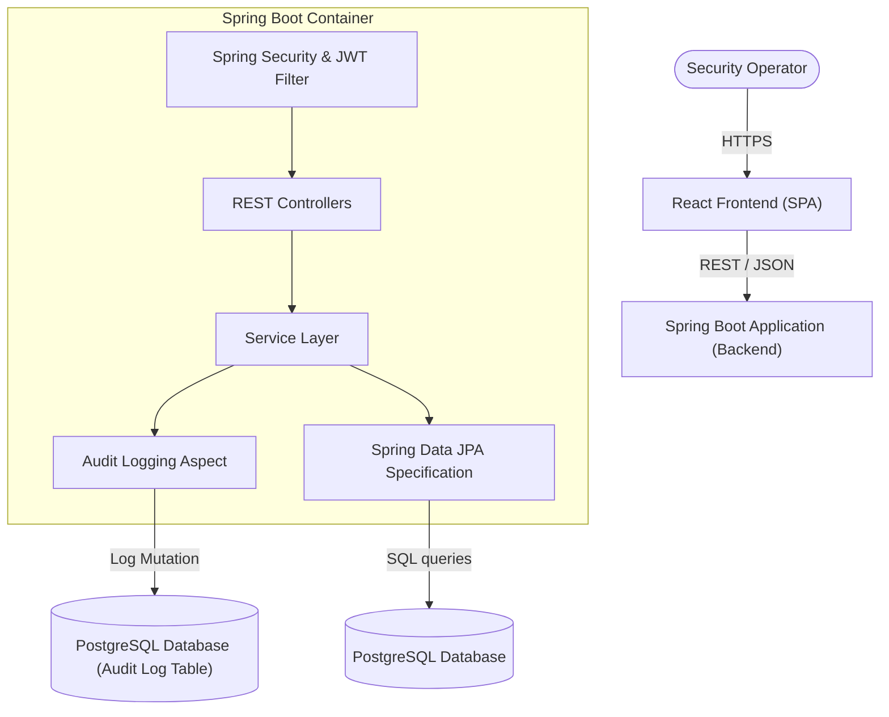
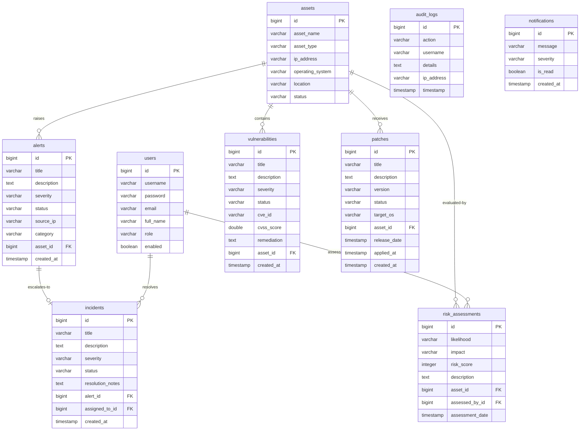
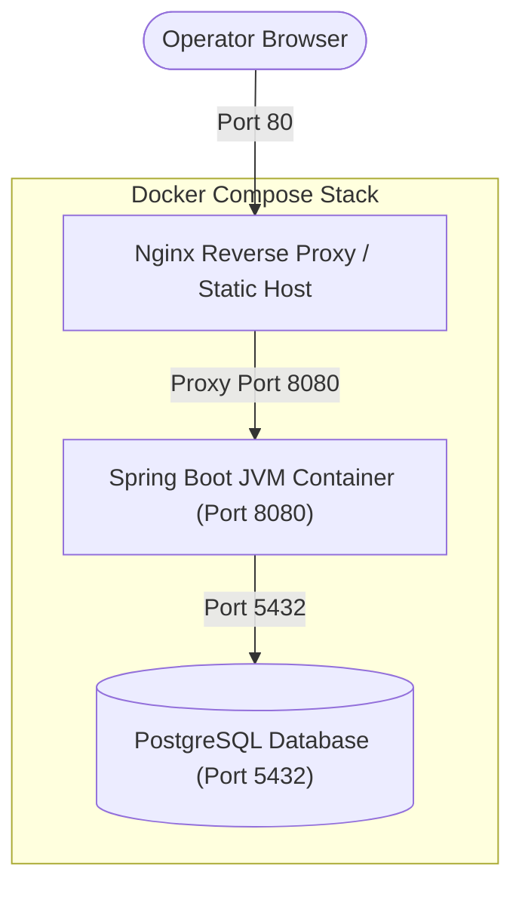

# SentinelCore Security Platform

SentinelCore is an enterprise-grade Security Operations and Infrastructure Monitoring platform. It provides organizations with real-time asset visibility, automated vulnerability tracking, threat intelligence feed integration, structured incident escalation queues, interactive risk matrices, and platform-wide mutation audit logs.

---

## 🏗️ Architecture Diagrams

### 1. System Architecture
The platform is designed around a multi-layered decoupled client-server architecture:


### 2. Entity-Relationship (ER) Diagram
The PostgreSQL relational model maps system assets to alerts, incidents, vulnerability indexes, and risk profiles:


### 3. Deployment Topology
Local orchestration and cloud deployment mapping:


---

## 🛠️ Technology Stack

### Backend
- **Java 21** & **Spring Boot 3.5.5**
- **Spring Security** (Stateless Session with JWT Authentication)
- **Spring Data JPA** with Specification API for dynamic searching, sorting, and paging
- **PostgreSQL** (Active persistence layer)
- **Spring Boot Actuator** (Platform metrics exposure)
- **Springdoc OpenAPI v2** (Swagger interactive docs)
- **Jakarta Bean Validation** (Request constraints checks)
- **Lombok** (Boilerplate reduction)
- **Apache POI** (Excel reporting) & **OpenPDF** (PDF printing)

### Frontend
- **React 18** (Vite-based Build Toolchain)
- **Material UI (MUI) v5** (Responsive layout widgets)
- **Recharts** (Visual analytics & statistics charts)
- **Axios** (Consolidated HTTP interceptor client)
- **React Router DOM v6** (Structured routing configuration)

---

## 🚀 Setup & Local Launch

### Prerequisites
- **Java Development Kit (JDK) 21**
- **Node.js (v20+)**
- **PostgreSQL Server (v15+)**
- **Docker & Docker Compose** (Optional, for containerized run)

### Running Locally

#### 1. Setup PostgreSQL Database
Make sure you have a database named `sentinelcore_db` running on port `5432`:
```sql
CREATE DATABASE sentinelcore_db;
```

#### 2. Start Backend API
Navigate to the `backend` folder and run using the Maven wrapper:
```bash
cd backend
./mvnw clean spring-boot:run
```
*The server will boot on `http://localhost:8080`.*
*The default administrator account is initialized automatically: `admin` / `admin123`.*

#### 3. Start React Frontend
Navigate to the `frontend` folder, install dependencies, and launch Vite dev server:
```bash
cd frontend
npm install
npm run dev
```
*The app will open on `http://localhost:5173`.*

---

## 🐳 Docker Deployment
To launch the entire stack (PostgreSQL, Java API, Nginx React Frontend) in one command:
```bash
docker-compose up --build -d
```
- **React Web App**: `http://localhost`
- **Spring Boot API**: `http://localhost:8080`
- **Swagger Documentation**: `http://localhost:8080/swagger-ui/index.html`

---

## 📊 Spring Boot Actuator & Metrics
Actuator endpoints are exposed for monitoring:
- Health check: `http://localhost:8080/actuator/health`
- All metrics: `http://localhost:8080/actuator/metrics`
- Prometheus endpoints: `http://localhost:8080/actuator/prometheus`

---

## 📝 API Reference

| Endpoint | Method | Description | Auth Required |
| :--- | :--- | :--- | :--- |
| `/api/auth/login` | POST | Login with username/password | No |
| `/api/auth/register` | POST | Register a new operator | No |
| `/api/assets` | GET | List & search assets (paged) | Yes |
| `/api/alerts` | GET | List & search alerts (paged) | Yes |
| `/api/incidents` | GET | List & search incidents | Yes |
| `/api/vulnerabilities`| GET | List system vulnerabilities | Yes |
| `/api/risk-assessments`| GET | List and create risk profiles | Yes |
| `/api/patches` | GET | List, create, and deploy patches | Yes |
| `/api/reports/incidents/pdf`| GET | Download incident resolution brief | Yes |
| `/api/reports/assets/excel`| GET | Download assets spreadsheet | Yes |